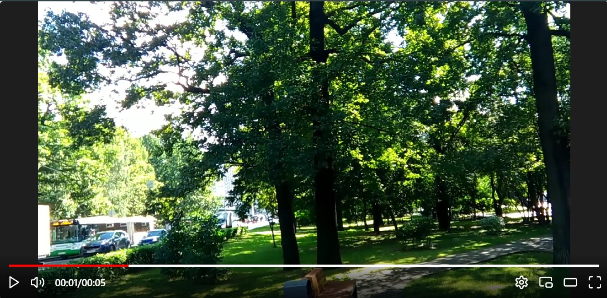

<div
style="display:flex; justify-content:center; align-items:center">
	
	
</div> 

 

###### v-player library a customizable and easy to use video player for react application.


# v-player
---

 


##### Video player for react application.

# Installation Guide
---

###### using yarn
```sh
yarn add v-player
```
###### using npm
```sh
npm i v-player
```
###### using npm
```sh
npm install v-player
```

# Getting Started
---


##### Basic Implementation

```jsx

import { 
	controlOptionsEnum, 
	VPlayer } 
from "v-player"

<VPlayer source={"Your video source"} />
```


#### Supported Formats

| Format      | Description                                          | File Type         |
|-------------|------------------------------------------------------|-------------------|
| MP4         | A widely supported video format, ideal for most use cases. | `.mp4`            |
| OGG         | Open-source video format with broad browser support, often used for web streaming. | `.ogv`            |
| WebM        | Open and royalty-free video format, commonly used in modern browsers for HTML5 video. | `.webm`           |
| HLS         | HTTP Live Streaming, used for streaming video over the internet in real-time. | `.m3u8` (playlist) |
| MPEG-DASH   | Dynamic Adaptive Streaming over HTTP, a streaming protocol for high-quality video streaming. | `.mpd` (playlist) |


## Documentation

#### Control options
- If you want only few video controls just remove them from `.controlOptions`.

```jsx

<VPlayer
        source={sources[3]}
		// all control options available
        controlOptions={[
          controlOptionsEnum.PLAY,
          controlOptionsEnum.MUTE,
          controlOptionsEnum.SETTINGS,
          controlOptionsEnum.PICTURE_IN_PICTURE,
          controlOptionsEnum.THEATER_MODE,
          controlOptionsEnum.PREVIOUS,
          controlOptionsEnum.NEXT,
          controlOptionsEnum.SETTINGS,
          controlOptionsEnum.FULLSCREEN
        ]}
/>


```
#### Loading
- If you want custom loading HTML Element pass the `.loadingAsset` which is a `.ReactNode` type.

```jsx

<VPlayer
    source={sources[3]}
	loadingAsset={<div>Loading...</div>}
/>

```

#### Custom Events
- If you want custom analytics feature you can add the `.Javascript` event listeners directly to the `.events` prop.

```jsx

<VPlayer
    source={sources[0]}
    events={
        {
        	onLoadedData: () => console.log("Loaded data"),
        	onError: () => console.log("Error")
          }
        }
/>

```

#### Video Header
- If you want to add custom header to the video to show video title or some other option you can pass `.VideoHeader`.

```jsx

<VPlayer
        source={sources[0]}
        VideoHeader={<h1>Custom Video Header</h1>}
    />

```

#### Previous and Next click
- Handle the previous video link and next video link.

```jsx

<VPlayer
        source={sources[0]}
        handleNext={() => console.log("Next")}
        handlePrev={() => console.log("Prev")}
    />

```

#### Custom video and videocontainer styles
- You can add custom styles to the `.VideoContainer` or `.Video` element.

```jsx

<VPlayer
        source={sources[0]}
        videoContainerStyles={
          {
            width: "100%",
            height: "100%"
			// and soo on..
          }
        }

        videoStyles={
			{
			width: "100%",
            		height: "100%"
			// and soo on..
        		}
        }
    />

```

#### Theater Mode
- You can adjust the `.TheaterMode` 

```jsx

<VPlayer
        source={sources[0]}
        handleTheaterMode={() => console.log("Theater Mode")}
    />

```


